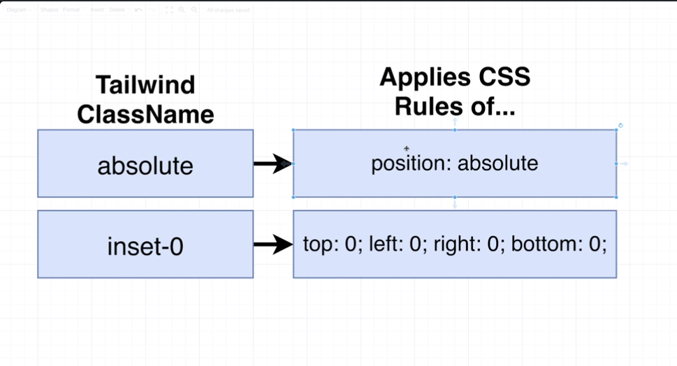
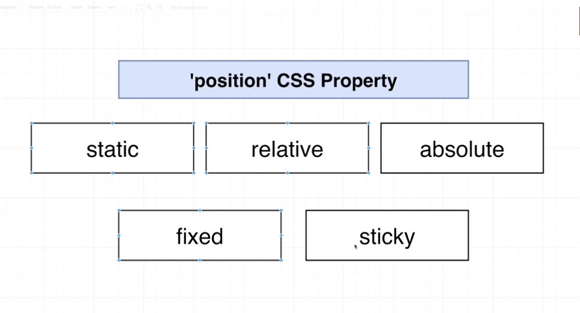

# 🟩 How to build Modals in react (section 14)

- we will make use of react portals to create modals

- make a state at the ModalPage (parent for Modal component) and based
  on this state render the Modal

```js
const [showModal, setShowModal] = useState(false);
{
  showModal && <Modal></Modal>;
}
```

- The modal will contain 2 divs

  1. for the gray background
  2. another one for the content inside the modal

- The inset CSS property is a shorthand that corresponds to the top, right, bottom, and/or left properties. It has the same multi-value syntax of the margin shorthand.





- types of positioning : static, relative,absolute, fixed, sticky
- the absolute postion can be lined to any parent that does not has a static position

- to fetch all the element that does not have position:static, paste the code into the console without using console.log()

```js
[
  ...document.querySelectorAll("*").filter((ele) => {
    return !["", "static"].includes(ele.style.position);
  }),
];
```
- we gonna make use of the `children` & `actionBar` props insside the Modal component, it's better to separate the content of the modal from the action bar buttons 


- to fix the scroll issue : 
    - add overflow-hidden to the body by useEffect and remove it with cleanup function 
---

# 🟩 How to make dropdown with react (section 12)

- 


