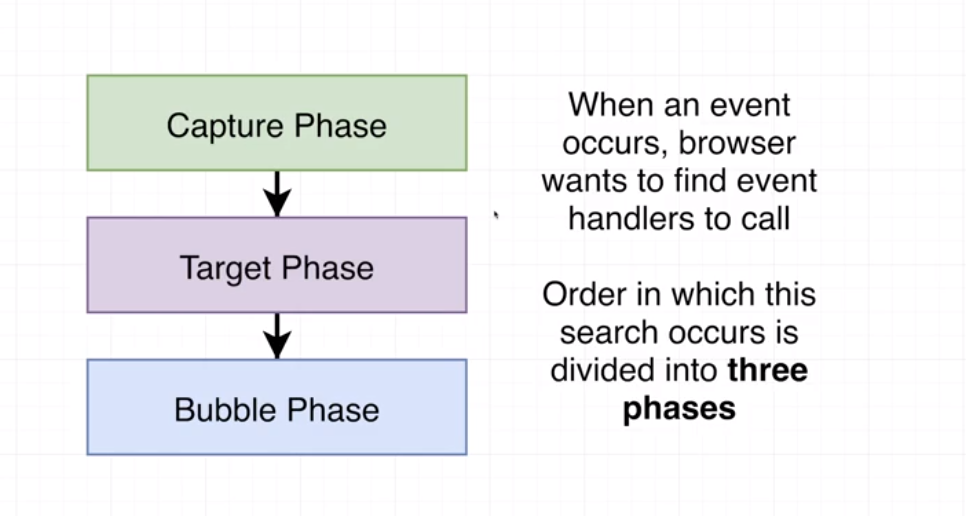
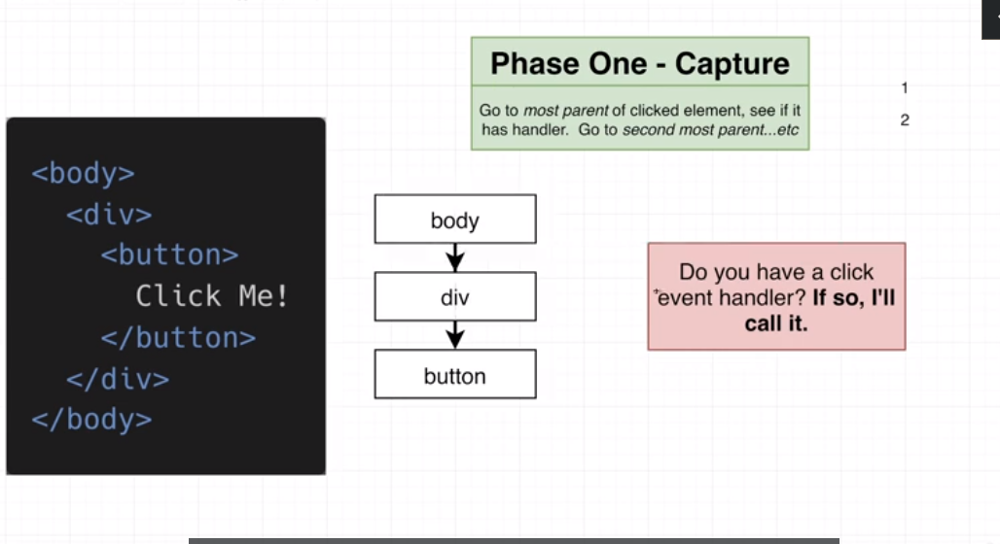

# 🟩 How to build Modals in react (section 14)

- we will make use of react portals to create modals

- make a state at the ModalPage (parent for Modal component) and based
  on this state render the Modal

```js
const [showModal, setShowModal] = useState(false);
{
  showModal && <Modal></Modal>;
}
```

- The modal will contain 2 divs

  1. for the gray background
  2. another one for the content inside the modal

- The inset CSS property is a shorthand that corresponds to the top, right, bottom, and/or left properties. It has the same multi-value syntax of the margin shorthand.


- types of positioning : static, relative,absolute, fixed, sticky
- the absolute postion can be lined to any parent that does not has a static position

- to fetch all the element that does not have position:static, paste the code into the console without using console.log()

```js
[
  ...document.querySelectorAll("*").filter((ele) => {
    return !["", "static"].includes(ele.style.position);
  }),
];
```

- we gonna make use of the `children` & `actionBar` props insside the Modal component, it's better to separate the content of the modal from the action bar buttons

- to fix the scroll issue :
  - add overflow-hidden to the body by useEffect and remove it with cleanup function

---

# 🟩 How to make dropdown with react (section 12)

- use `functional state update` when you update a state that depends on
  it's old value

```js
setIsOpen((current) => {
  return !current;
});
```

- building the dropdown as a controlled object

- intead of write this

```js
let content = "Select...";
if (selection) {
  content = selection.label;
}
```
write this 
```js 
let content = selection?.label || 'Select...'
```
- the `?` checks if the variable if defined or not, to avoid getting 
error messages 

- The `OR` operator returns the first truthy variable 
    - undefined || 10   ---> it will return 10
    

#### 210. Event capture & bubbling  
🔹 When an event occurs, browsers wants to find event handlers to call.
order in which this `search` occurs is divided into three phases 


1) phase one : capture phase 
go to most parent of clicked element, see if it has handlder, go to the second most parent, etc 



- it will check the body then the div if they have event handlers 


2) Phase two : target phase 
go to the clicked element, check to see if it has event handler 

3) phase three: bubbling phase 
go to parent of clicked element, see it has handler. then go to parent'parent...etc


#### 212. why a capture phase handler 
- if we removed the `true` of the capture event, the detection of clicking inside the dropdown won't work as expected, since react takes time to rerender the component 

- when i click on one of the selection option,the options list have to disappear but the console.log() of will show  `click outside`

- it takes more time at the bubbling phase 

- performance.now()